# YouTube Clipster

**Loresoft YouTube Clipster** downloads YouTube videos or audio automatically as soon as you copy a
YouTube link to your clipboard.

Since **v2.0** the whole program is written in **Python** and runs from **one single code base** on
**Linux and Windows** (macOS works too). The former Bash edition (`linux/*.sh`) and Batch/PowerShell
edition (`windows/*.bat`) have been replaced by the `clipster/` package.

---

## Features

- **Runs in the background** – lives in the system tray and watches the clipboard
- **Two windows, each with one job**
  - a small **navigation window** that opens when you copy a link: pick format and audio track,
    watch the progress, see the result
  - a large **view window** with Streaming, the download list, settings and about
- **Streaming** – find similar songs from downloads, likes, and local media; play Audio or Video
  in-tab, Stage visualizer (default **Beat ring** / `pulse`), likes/dislikes
- **Download list** – name, length, size, date and status of every download, with per-row
  *Play*, *Folder* and *Hide* buttons, status filters and a problem description when something failed
- **Dark, modern interface** – one colour scheme (`clipster/theme.py`), identical on every platform
- **Format selection** – audio (MP3) or video (MP4), with a preselectable default
- **Audio track selection** – offered when a video has several languages
- **Declared dependencies** – everything the program needs is data in `clipster/dependencies.py`;
  the installer reads that table, works out what is missing, installs it and starts the program
- **Self-updating** – `yt-dlp` is kept up to date automatically
- **Phone interface** – send links from your Android phone or iPhone, the PC downloads them;
  no app to install, see [Your phone](#your-phone-android-and-iphone)
- **Multi-language** – English and German (`clipster/locales/*.json`)
- **Single instance** – a second start is refused with a clear message
- **Desktop integration** – optional desktop shortcut and login autostart

---

## Screenshots

Anonymized captures of the real Tk UI (fixture data only):

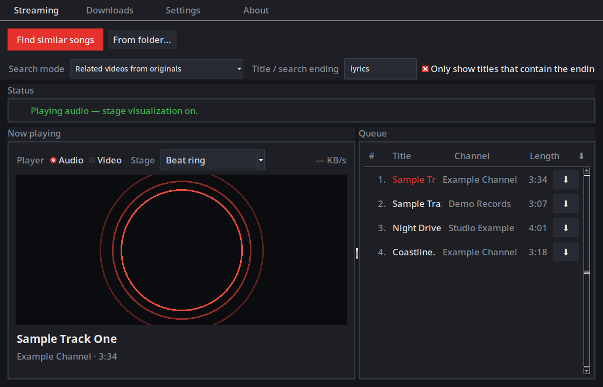

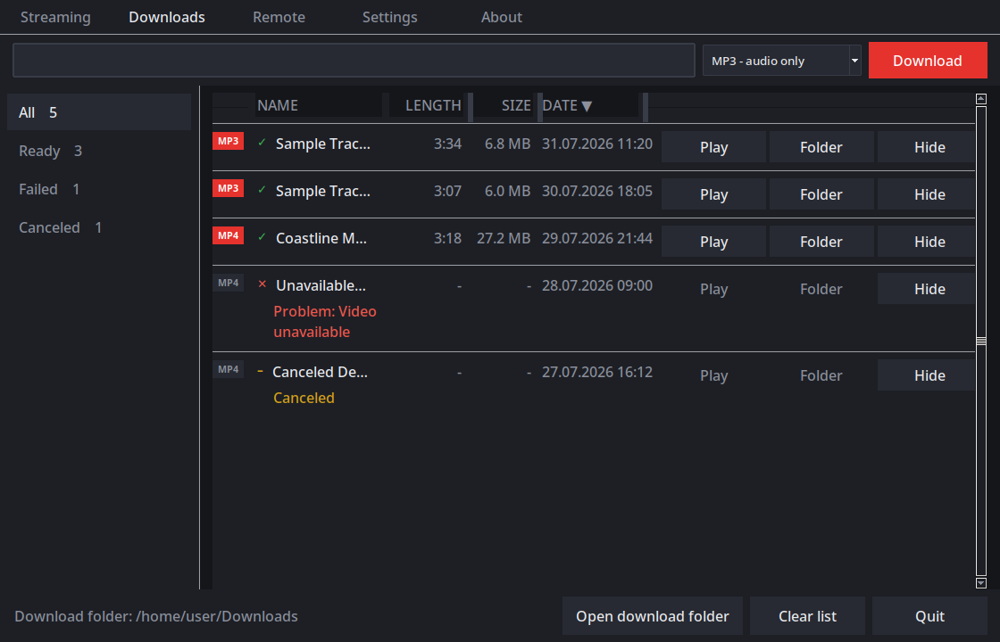

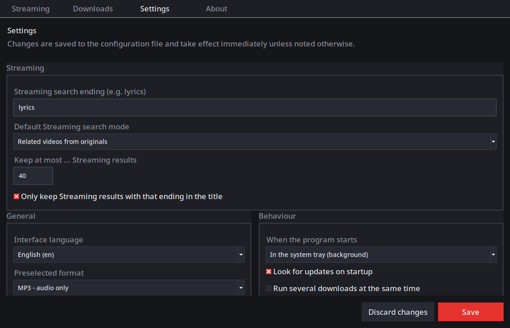

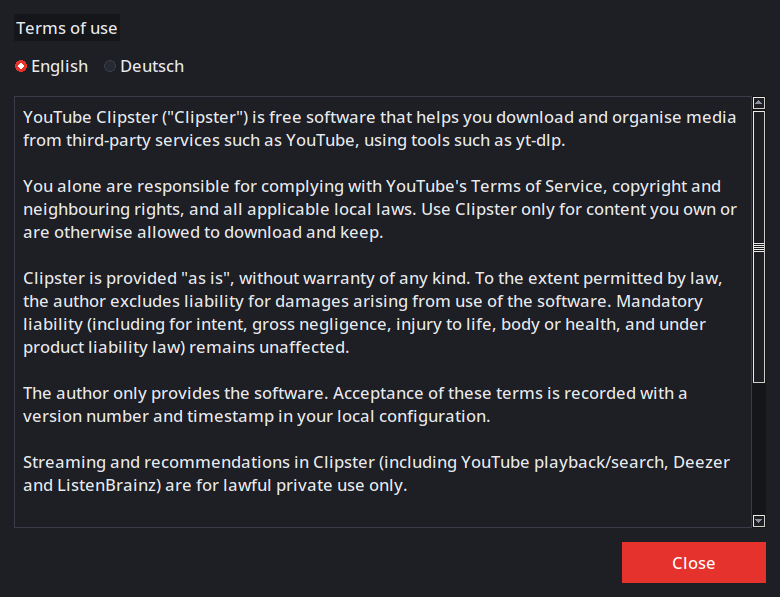

The phone interface, served by the running program to your Android phone or iPhone:

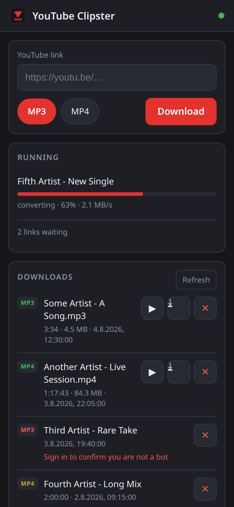

More detail: [User guide](docs/USER_GUIDE.md) · [Technical documentation](docs/TECHNICAL.md)

---

## Requirements

| | Linux / macOS | Windows |
|---|---|---|
| **Python** | 3.8 or newer | 3.8 or newer |
| **GUI** | `python3-tk` | included in the Python installer |
| **Clipboard** | `xclip` (X11) or `wl-clipboard` (Wayland) | built into Windows |
| **Download engine** | `yt-dlp` | `yt-dlp` |
| **Media processing** | `ffmpeg` | `ffmpeg` |
| **System tray** *(optional)* | `pystray`, `Pillow`, `python-xlib` | `pystray`, `Pillow` |
| **Phone QR code** *(optional)* | `qrcode` | `qrcode` |

**You do not have to install any of this by hand.** The bootstrapper `run.py` checks
every component on each start and installs what is missing – see
[What the installer does](#what-the-installer-does).

Tested desktops: X11 and Wayland, Debian/Ubuntu/Mint/Pop!\_OS (`apt`), Fedora (`dnf`), Arch
(`pacman`), openSUSE (`zypper`), Alpine (`apk`), and Windows 10/11.

---

## Installation

### Linux

```bash
# 1. Clone the repository
git clone https://github.com/joruf/youtube-clipster.git
cd youtube-clipster

# 2. Make the starter executable (only needed once)
chmod +x install.sh run.py

# 3. Install everything that is missing and start the program
./install.sh
```

`install.sh` looks for a suitable Python 3, installs it through your package manager if it is
missing, and then hands over to `run.py`.

Installing system packages (`ffmpeg`, `python3-tk`, `xclip`, …) needs **root**, so you will be asked
for your `sudo` password **in the terminal**. Everything else is installed into your user profile
without root.

> Prefer to do it yourself? `python3 run.py` works exactly the same way, and
> `--no-auto-install` only reports what is missing instead of installing it.

### Windows

```bat
REM 1. Clone the repository (or download the ZIP from GitHub and unpack it)
git clone https://github.com/joruf/youtube-clipster.git
cd youtube-clipster

REM 2. Install everything that is missing and start the program
run.bat
```

Or simply **double-click `run.bat`** in Explorer.

`run.bat` starts the program through `pythonw.exe`, so there is no console window. What the setup is
doing is shown in a small window instead – naming the component being installed right now – and once
everything is in place YouTube Clipster starts by itself. The first start downloads `yt-dlp` and
`ffmpeg` and takes a few minutes.

The console stays visible only while it is still needed: to find or install Python, when `tkinter` is
missing (no `tkinter`, no window), and whenever you pass options such as `run.bat --check`, because
that output belongs in the console. If the setup cannot be completed, the missing components are
reported in a dialog rather than on an invisible `stderr`.

If no Python is found, `run.bat` offers to install it via `winget`. Without `winget` it opens
<https://www.python.org/downloads/> – make sure **“Add python.exe to PATH”** is ticked during that
installation, then start `run.bat` again.

`install.bat` does the same thing but keeps the console window and its log output, which is the better
choice when something goes wrong and you want to see every line.

Windows Defender / SmartScreen may ask for confirmation on the first start because `yt-dlp` and
`ffmpeg` are downloaded. Allow the access.

---

## What the installer does

Everything the program needs is **declared as data** in
[`clipster/dependencies.py`](clipster/dependencies.py): the pip packages, the system tools, whether a
piece is required or optional, and what stops working without it. `clipster/installer.py` reads that
table, works out what is missing, installs it and then starts the program. Adding a requirement means
adding a row there – `requirements.txt` is generated from the same table:

```bash
python3 -c "from clipster import dependencies as d; print(d.requirements_text(), end='')" > requirements.txt
```

`run.py` runs the following steps on **every** start (they are skipped when everything
is already in place, so a warm start takes about a second):

1. **Python version** – aborts with a clear message on anything older than 3.8.
2. **tkinter** – Linux: installs the distribution package (`python3-tk`, `python3-tkinter`, `tk`, …).
   Windows: reports how to add it, since it ships with the official installer.
3. **Virtual environment** – creates a private venv so nothing is installed into your system Python
   (on Linux with `--system-site-packages`, so the system PyGObject stays visible for the tray menu;
   the environment's own packages still win in `sys.path`):
   - Linux/macOS: `~/.local/share/YoutubeClipster/venv`
   - Windows: `%LOCALAPPDATA%\YoutubeClipster\venv`
   A broken or half-written environment is repaired or rebuilt automatically.
4. **yt-dlp** – installed into that venv and updated at most once every 24 hours
   (`update_check_hours`, or `--update` to force a check).
5. **FFmpeg** – Linux/macOS via the package manager; Windows downloads the official build and
   unpacks it to `%LOCALAPPDATA%\YoutubeClipster\ffmpeg`. An `ffmpeg` already in `PATH` is used as is.
6. **Clipboard helper** – Linux only: `xclip` or `wl-clipboard`, depending on X11 or Wayland.
   Tkinter is used as a fallback if neither can be installed.
7. **Tray menu** *(optional, Linux)* – installs PyGObject and the AppIndicator typelib, without
   which the tray icon cannot show a menu. Never blocks the start.
8. **System tray** *(optional)* – installs `pystray`, `Pillow` and, on Linux, `python-xlib`.
   Never blocks the start; without them the view window is shown instead.
9. **JavaScript runtime** *(optional)* – `quickjs`/`node`/`deno` help a few yt-dlp extractors.
   The engine that is present is named explicitly, because yt-dlp otherwise only tries deno.
   Never blocks the start.

Afterwards the program restarts itself with the venv interpreter and begins monitoring the clipboard.

Check the setup without starting the program:

```bash
python3 run.py --check      # Linux/macOS
run.bat --check                          # Windows
```

---

## Usage

The program has **no main window**. It sits in the system tray and waits.

### 1. Copy a YouTube link

The small navigation window appears with the video title and its length. Choose the format and, on
multilingual videos, the audio track.

The track question only appears when the video really offers several languages **and**
`ask_audio_language` is on. Otherwise the track is picked automatically: the only one that exists,
or – with several – the one the video was published with, which is marked `· original` in the list.

**Copying several links in a row** is fine: they queue up instead of being dropped, up to twenty
waiting at a time. With `parallel_downloads` on they start straight away, up to
`max_parallel_downloads` at once; the question about format and audio track stays one at a time,
because there is only one navigation window.

**A video that is already there** is not fetched twice. When the same link in the same format was
downloaded before and the file still exists, the window says so and offers to open it, its folder, or
to download it again anyway.

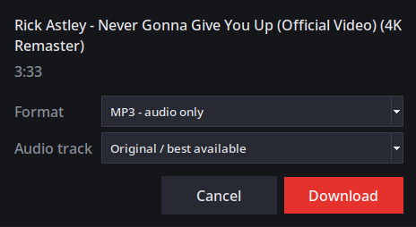

### 2. Watch it download

The same window shows the progress, the speed and the remaining time. **Cancel** stops it.

Converting and merging report a real percentage too, plus the position in the media
(`1:40 / 3:33`), so a long video does not sit behind an anonymous busy bar. The figure comes from
ffmpeg itself: yt-dlp offers no progress for its post-processors, so ffmpeg is asked to write its
`-progress` output to a file that the program reads while the conversion runs.

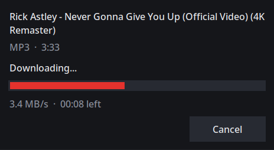

### 3. Done

The result stays on screen with buttons to open the file or its folder.

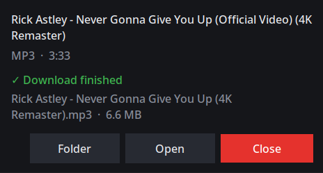

Files are saved to your download folder:

- Linux/macOS: `~/Downloads` (the XDG folder is honoured)
- Windows: `%USERPROFILE%\Downloads`

### The view window

Open it from the tray icon, or let it open itself after every download
(`open_view_after_download`). It never gets in the way of a download.

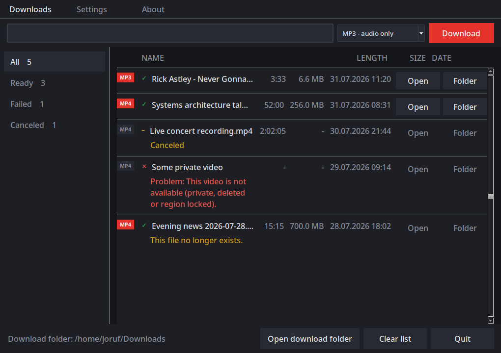

- **Toolbar** – paste a link and press *Download* to start one by hand
- **Sidebar** – filter by *All*, *Ready*, *Failed* or *Canceled*, with live counts
- **Table** – name, length, size and date, plus three buttons per row: *Play* opens the file in the
  system's default player, *Folder* reveals it in the file manager, *Delete* removes the file from
  the disk and the row from the list. The first two are disabled once a file has been moved or
  deleted; *Delete* stays available, so a failed attempt can be cleared away.
- **Failed rows** say what went wrong right under the name

Settings are edited in the same window and written straight to `config.json`:

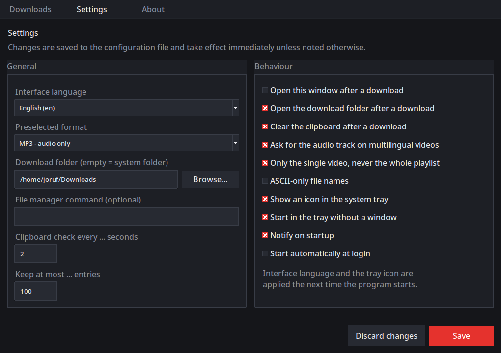

The about page lists the version, every path the program uses and the full dependency table:

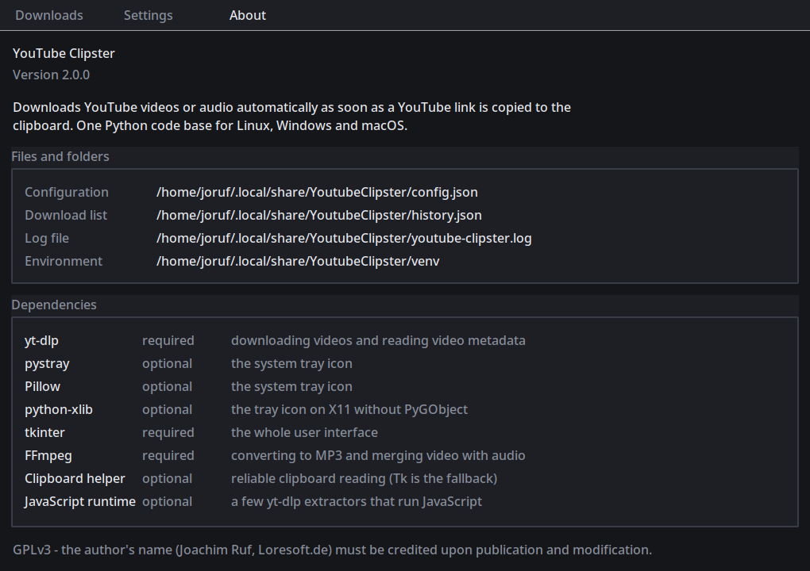

### The system tray

| Action | Result |
|---|---|
| Click the tray icon | opens the view window with the download list |
| Right click the tray icon | menu: **Show window**, **Open download folder**, **Quit** |
| Closing the view window | hides it again – the program keeps running |
| **Quit** in the view window or in the tray menu | ends the program |

Hovering the icon shows what the program is currently doing.

Both need a capable tray backend, and they do not come together everywhere. The program picks the
best one available and writes its choice to the log:

| Backend | Menu | Click on the icon | Used on |
|---|---|---|---|
| `gtk` | yes | yes | preferred everywhere except GNOME |
| `appindicator` | yes | **no** | GNOME and friends, where GTK's status icon is not shown |
| `xorg` | **no** | yes | last resort, when PyGObject is missing |

All of them need PyGObject (`gi`) except the last – the installer takes care of it, and the private
environment is created with `--system-site-packages` so the system PyGObject stays visible. Pin a
backend yourself with `PYSTRAY_BACKEND=gtk`. See
[The tray icon has no menu](#the-tray-icon-has-no-menu).

Turn the tray off with `--no-tray` or `"use_tray": false`. Without a tray the view window is shown
at startup and closing it quits the program, so there is always a way out.

---

## Updates

The about page shows whether the installation is current and updates it on request:


The repository publishes neither releases nor tags, so "newer" means the head commit of `main`
differs from the one this installation sits on. The check runs at startup at most once every
`update_check_hours` and can be turned off with `check_updates`.

Installing takes one of two routes:

| Situation | What happens |
|---|---|
| Started from a git clone | `git pull --ff-only` |
| Installed from an archive | the branch ZIP is downloaded and unpacked over the installation |

Neither route can lose your work: the git route refuses to run when the working tree is dirty or has
local commits, and the archive route never touches `config.json`, `history.json` or the `.git`
folder. Your downloads live outside the installation anyway.

Afterwards the program restarts itself.

---

## Configuration

The configuration is a JSON file that is created with defaults on the first start:

| Platform | Path |
|---|---|
| Linux/macOS | `~/.local/share/YoutubeClipster/config.json` |
| Windows | `%LOCALAPPDATA%\YoutubeClipster\config.json` |

For a **portable setup** copy `config.example.json` to `config.json` **next to
`run.py`** – that file then wins over the per-user one.

| Key | Default | Meaning |
|---|---|---|
| `language` | `"en"` | UI language, any file name in `clipster/locales` (`en`, `de`) |
| `download_dir` | `""` | Target folder; empty means the OS download folder |
| `interval_sec` | `2.0` | Clipboard polling interval in seconds |
| `show_startup_notification` | `true` | Short notification on start |
| `default_format` | `"mp3"` | Format preselected in the navigation window (`mp3` / `mp4`) |
| `open_view_after_download` | `false` | Open the view window when a download finished |
| `history_limit` | `100` | Maximum number of entries kept in the download list |
| `check_updates` | `true` | Look for a newer version on GitHub at startup |
| `parallel_downloads` | `false` | Run several downloads at the same time |
| `max_parallel_downloads` | `3` | Upper bound while `parallel_downloads` is on |
| `use_tray` | `true` | Place an icon in the system tray |
| `start_minimized` | `true` | Start in the tray without showing any window |
| `open_folder_after_download` | `false` | Open the target folder when a download finished |
| `file_manager` | `""` | Explicit file manager (e.g. `"nemo"`); empty uses the OS default |
| `clear_clipboard_after_download` | `true` | Empty the clipboard so the link is not processed twice |
| `ask_audio_language` | `true` | Ask for the audio track on multilingual videos; when off the original track is used |
| `no_playlist` | `true` | Download only the video, never the whole playlist |
| `restrict_filenames` | `false` | ASCII-only file names (old `--restrict-filenames` behaviour) |
| `output_template` | `"%(title)s.%(ext)s"` | yt-dlp output template |
| `user_agent` | `""` | Custom HTTP user agent |
| `cookies_from_browser` | `""` | Browser for yt-dlp cookies (`firefox`, `chrome`, …; empty = off) |
| `cookies_file` | `""` | Path to a Netscape cookies.txt for yt-dlp |
| `ask_desktop_shortcut` | `true` | Ask once whether a desktop shortcut should be created |
| `autostart` | `false` | Start automatically at login |
| `remote_enabled` | `false` | Serve the phone interface (see [Your phone](#your-phone-android-and-iphone)) |
| `remote_bind` | `"127.0.0.1"` | `0.0.0.0` lets other devices in; the default keeps it on this PC |
| `remote_port` | `8733` | TCP port of the phone interface |
| `remote_token` | `""` | Shared secret; generated on first start and written back here |
| `update_check_hours` | `24` | Hours between two yt-dlp update checks (`0` = every start) |
| `log_level` | `"INFO"` | `DEBUG`, `INFO`, `WARNING` or `ERROR` |
| `discover_search_suffix` | `"lyrics"` | Word appended to Streaming searches; empty disables it |
| `discover_require_suffix` | `true` | Keep only Streaming results whose title contains the suffix |
| `discover_mode` | `"related"` | `search`, `related`, `deezer`, or `listenbrainz` |
| `discover_max_results` | `40` | Maximum Streaming results shown |
| `discover_play_video` | `false` | Prefer video in the Streaming player when a backend is available |
| `discover_visualizer` | `"pulse"` | Stage mode (`off`, `text`, `waveform`, `cover`, `pulse`, `spectrum`, `visualizer`) |

See [`config.example.json`](config.example.json) and [Technical documentation](docs/TECHNICAL.md#configuration-keys-overview) for the full key list (including terms acceptance fields).

The log file lives next to the configuration:
`~/.local/share/YoutubeClipster/youtube-clipster.log` (Windows: `%LOCALAPPDATA%\…`).

---

## Command line options

`install.sh`, `run.bat` and `install.bat` forward every option to `run.py`.

```
--check               only check/install dependencies, do not start
--skip-checks         start without checking dependencies (fast start)
--update              force a yt-dlp update check
--reinstall           rebuild the virtual environment from scratch
--no-venv             use the current interpreter instead of a private venv
--no-auto-install     report missing components instead of installing them

--phone-setup         guided setup that connects your phone, then exit
--create-shortcut     create a desktop shortcut and exit
--autostart on|off    enable or disable the login autostart and exit

--config FILE         path to an alternative config.json
--lang CODE           UI language, e.g. de or en
--download-dir DIR    target directory for downloads
--no-window           never show the view window at startup
--no-tray             do not place an icon in the system tray
--show-window         start with the view window open
-v, --verbose         verbose (DEBUG) logging
--version             print the version
```

---

## Autostart and desktop shortcut

**Desktop shortcut** – offered once on the first start, or created explicitly at any time:

```bash
python3 run.py --create-shortcut     # Linux/macOS
run.bat --create-shortcut                         # Windows
```

- Linux: a freedesktop `.desktop` launcher on your desktop, marked executable and trusted
- Windows: a `.lnk` shortcut that starts without a console window

**Autostart at login**

```bash
python3 run.py --autostart on        # enable
python3 run.py --autostart off       # disable
```

- Linux: `~/.config/autostart/youtube-clipster.desktop`
- Windows: registry value `HKCU\Software\Microsoft\Windows\CurrentVersion\Run\YouTubeClipster`

`"autostart": true` in `config.json` has the same effect and is applied on every start.

---

## Your phone (Android and iPhone)

You can operate YouTube Clipster from your phone: the phone sends a link, **the PC downloads it**,
and the phone shows the list and plays the result. There is nothing to install — the running program
serves a small web page, so the same thing works on Android and on the iPhone.


Why it works this way: Android has forbidden reading the clipboard in the background since Android 10,
so the "copy a link and it downloads" trick cannot exist there. And an app that downloads YouTube
content is not allowed into Google Play or the App Store. A page served by your own PC has neither
problem — and needs no store at all.

### The guided way (recommended)

One command does all of it — settings, token, firewall, QR code — and then **waits until your phone
has actually connected**, so you know it works before you start using it:

```bash
python3 run.py --phone-setup     # Linux/macOS
run.bat --phone-setup            # Windows
```

It walks through six steps, asks before it changes anything, and shows you the exact firewall command
before running it. If the phone does not get through, it names the usual reasons instead of leaving you
guessing.

Everything below describes the same thing done by hand — useful to understand what the wizard did, or
when you would rather do it yourself.

### 1. Switch it on

The phone interface is **off** by default, and even when switched on it stays on the PC until you
allow other devices in. Both keys in `config.json` have to change:

```json
{
  "remote_enabled": true,
  "remote_bind": "0.0.0.0"
}
```

| Value | Who can reach it |
|-------|------------------|
| `"remote_bind": "127.0.0.1"` | only this PC (the default) |
| `"remote_bind": "0.0.0.0"` | every device on the networks this PC is on — needed for your phone |

Then restart YouTube Clipster. On the first start a token is generated and written back into
`config.json`; you do not have to invent one.

**Windows** asks once whether the program may accept connections. Allow it for **private networks** —
without that the phone cannot reach the PC. On Linux with an active firewall, let the port through:

```bash
sudo ufw allow 8733/tcp     # only if ufw is enabled
```

### 2. Read the address

The startup log prints the complete address, token included:

```
[INFO]  The phone interface is listening on http://0.0.0.0:8733/
[INFO]  Open this on your phone: http://192.168.1.42:8733/?token=ugRFRjQpigmZNQHUlay9CWUYme1
```

The log file is next to the configuration
(`~/.local/share/YoutubeClipster/youtube-clipster.log`, Windows `%LOCALAPPDATA%\…`) — or start with
`-v` and read it in the console.

You do not have to read this out of the log at all — step 3 hands you the same address as a QR code.

### 3. Get it onto the phone

Phone and PC have to be on the **same Wi-Fi**. Nobody wants to type a 32 character token, so run this
on the PC:

```bash
python3 tools/phone_link.py
```

It prints the address and a QR code **into the terminal** — hold the phone's camera in front of the
screen, open the link it offers, and that is the whole transfer:

```
http://192.168.1.42:8733/?token=VpWAghuIyT0OurTjVptVhOCLFOqOAHmZ

█████████████████████████████████████
██ ▄▄▄▄▄ █    ▄  ▄   ▄█▀▄ ▄█ ▄▄▄▄▄ ██
██ █   █ █▀ ▄  ▄██▀████▀   █ █   █ ██
██ █▄▄▄█ ██▀ ▀▀█ █▄▀▀▀▀█ █▄█ █▄▄▄█ ██
        (… the full code follows …)
```

The tool also tells you when `remote_enabled` is still off or `remote_bind` still keeps the interface
on the PC, so it doubles as a check that step 1 worked. It works before the first program start too:
if no token exists yet, it generates one and writes it into `config.json` — the program then uses that
same token.

| Variant | What it does |
|---------|--------------|
| `python3 tools/phone_link.py` | address plus QR code in the terminal |
| `python3 tools/phone_link.py --png link.png` | additionally write the QR code as an image |
| `python3 tools/phone_link.py --url` | only the address, for piping somewhere |

The QR code is generated **on your machine** — the token is a password and is never sent to a web
service. It needs the optional package `qrcode`, which the installer offers; without it the tool still
prints the address.

Use Chrome on Android and Safari on the iPhone. The address has to be opened only once: afterwards the
phone keeps the token in a cookie and the address bar shows just `http://192.168.1.42:8733/`.

You can now paste a link, choose MP3 or MP4 and tap **Download**. The list below shows every
download with its length, size, date and status; ▶ plays it, ⤓ saves it to the phone, ✕ deletes the
file on the PC.

### 4. Put it on the home screen

Worth doing: on Android this is also what puts Clipster into the share menu.

- **Android (Chrome)** — menu ⋮ → *Add to home screen* → *Install*
- **iPhone (Safari)** — share button → *Add to Home Screen*

It then opens like an app, without a browser bar.

### 5. Share instead of copy (Android)

Once installed on the home screen, **Clipster appears in Android's share sheet**:

> YouTube app → **Share** → **Clipster** → the download starts immediately.

That is the closest thing to the clipboard automation on the PC — one tap, no typing, no pasting.

A link arriving this way is downloaded as **MP3**, because that is what the form has preselected. For
an MP4, open Clipster from the home screen, paste the link and choose MP4.

### 6. Share instead of copy (iPhone)

Safari has no share target, so iOS needs a small shortcut instead. In the **Shortcuts** app:

1. New shortcut → add the action **Get Contents of URL**
2. URL: `http://192.168.1.42:8733/api/submit?token=YOUR_TOKEN` — your address from step 2
3. Method: **POST**, Request Body: **JSON**, with two fields:
   - `url` → *Shortcut Input*
   - `format` → `mp3` (or `mp4`)
4. In the shortcut details, switch on **Show in Share Sheet** and set the input type to **URLs**

Sharing a video from the YouTube app to that shortcut then starts the download on the PC. This works
because the interface also accepts the token as a URL parameter, which is all the Shortcuts app can
send.

### Keep in mind

- **The token is the key to your PC.** Anybody on the same network who has it can start downloads and
  read every file you have already downloaded. Treat it like a password.
- **Do not forward the port in your router.** To reach the PC from outside your home, use a VPN such
  as [Tailscale](https://tailscale.com/) or WireGuard, which does not expose anything to the internet.
- **Revoking a phone**: empty `"remote_token"` in `config.json` and restart. A new token is generated
  and every old link stops working.
- **Switching it off entirely**: `"remote_enabled": false` and restart, or set `"remote_bind"` back to
  `"127.0.0.1"`.
- The PC has to be **running and awake** — it does all the work. The phone is only the remote control.
- The phone interface is currently **English only**, unlike the desktop windows.

### When something does not work

| Symptom | Cause and fix |
|---------|---------------|
| The page does not load at all | Phone on a different Wi-Fi (or a guest network), `remote_bind` still `127.0.0.1`, or the firewall is blocking the port. `--phone-setup` checks all three |
| "This device is not registered any more" | The cookie is gone. Open the full address with `?token=…` from step 2 again |
| The address from the log is `0.0.0.0` | That is the bind address, not a destination. Use the "Open this on your phone" line below it, or run `python3 tools/phone_link.py` |
| Nothing happens after *Download* | Look at the PC: the navigation window shows the same download, and the log gives the reason |
| The port is already in use | Set another `"remote_port"` and restart; the log says so plainly |
| No *Install* entry on Android | Chrome needs the app manifest, which is only served once the token was accepted. Open the address including `?token=…` and reload the page once |

---

## Tests

```bash
python3 -m pip install -r requirements-dev.txt
python3 -m pytest
```

Roughly 630 tests, all offline and finished in well under a minute. They never
touch your real configuration or download list - an autouse fixture redirects the
application data directory into a temporary folder for every single test.

| Selection | Command |
|---|---|
| Everything except the interface | `pytest -m "not gui"` |
| Only the interface | `pytest -m gui` |
| Including the two that talk to YouTube | `pytest -m network` |
| A single file | `pytest tests/test_downloader.py` |

Tests marked `gui` build the real windows and need a display; without one they
skip themselves, so the suite also passes over SSH. Run them headless with
`xvfb-run -a python3 -m pytest`.

The suite runs on every push through
[`.github/workflows/tests.yml`](.github/workflows/tests.yml): Linux on the oldest
and the newest supported Python, Windows without the GUI tests, plus a check that
`requirements.txt` and the logo files still match their generators.

---

## Documentation

| Doc | Contents |
|-----|----------|
| [User guide](docs/USER_GUIDE.md) | Install, first start, clipboard downloads, Streaming, settings, troubleshooting |
| [Technical documentation](docs/TECHNICAL.md) | Architecture, module map, config keys, testing |
| [Screenshots](docs/images/) | Anonymized UI captures (`streaming.png`, `downloads.png`, …) |

## Project structure

```
youtube-clipster/
├── run.py                   # bootstrapper: dependency check, relaunch, start
├── install.sh               # Linux/macOS starter (finds or installs Python)
├── run.bat                  # Windows starter (no console, progress in a window)
├── install.bat              # Windows starter (keeps the console and its log)
├── requirements.txt         # generated from clipster/dependencies.py
├── config.example.json      # documented example configuration
├── requirements-dev.txt     # pytest, for the test suite
├── pytest.ini               # test configuration and markers
├── docs/                    # USER_GUIDE.md, TECHNICAL.md, images/
├── tests/                   # the test suite (see "Tests" above)
├── tools/make_logo.py       # regenerates the logo (SVG + PNG + ICO)
├── tools/capture_screenshots.py  # anonymized UI screenshots for docs
├── tools/phone_link.py      # prints the phone address and a QR code for it
└── clipster/
    ├── cli.py               # argument parsing, bootstrap, relaunch into the venv
    ├── dependencies.py      # THE dependency definition - what is needed and why
    ├── installer.py         # reads that table and installs what is missing
    ├── app.py               # clipboard monitor, download pipeline, Streaming wiring
    ├── theme.py             # the dark colour scheme and every ttk style
    ├── gui.py               # owns the hidden Tk root and both windows
    ├── navwindow.py         # small window: format, progress, result
    ├── viewwindow.py        # large window: Streaming, list, settings, about
    ├── discover.py          # related-song search and DiscoverTrack
    ├── discover_page.py     # Streaming UI (queue, player, stage)
    ├── player.py            # in-tab Streaming playback
    ├── visualizer.py        # stage visualizer modes (default: pulse)
    ├── bridge.py            # marshals GUI calls onto the Tk thread (incl. Prompt)
    ├── downloader.py        # yt-dlp integration (metadata, download, progress)
    ├── history.py           # the persistent download list (history.json)
    ├── updater.py           # checks GitHub, fetches, restarts
    ├── webserver.py         # the phone interface: HTTP, token, Range requests
    ├── webapi.py            # what the phone may ask for, as plain data
    ├── phonesetup.py        # the guided --phone-setup wizard
    ├── web/                 # the page the phone loads (HTML, CSS, JS, manifest)
    ├── clipboard.py         # Win32 / wl-clipboard / xclip / xsel / pbpaste / Tk
    ├── singleinstance.py    # flock (POSIX) and named mutex (Windows)
    ├── shortcuts.py         # desktop shortcut, autostart, open file / reveal folder
    ├── config.py            # JSON configuration
    ├── terms.py             # versioned terms acceptance
    ├── i18n.py              # translations
    ├── paths.py             # platform paths
    ├── logging_setup.py     # console and file logging
    └── locales/             # en.json, de.json
```

Adding a language only means dropping a `clipster/locales/<code>.json` next to the existing files
and setting `"language": "<code>"`. Missing keys fall back to English.

---

## How it works

1. **Monitoring** – the clipboard is polled every `interval_sec` seconds.
2. **Detection** – a regular expression recognises `youtube.com/watch`, `youtu.be`, `/shorts/`,
   `/live/` and `/embed/` links.
3. **Metadata** – `yt-dlp` provides the title, the length and the available audio tracks.
4. **Question** – the navigation window asks for format and audio track in one step. The worker
   thread blocks on a `Prompt` while the Tk thread collects the answer.
5. **Download** – `yt-dlp` runs in that worker thread and reports exact progress values.
6. **Post-processing** – `ffmpeg` converts to MP3 or merges video and audio into MP4.
7. **Recording** – the outcome (finished, failed or canceled, with the reason) is appended to
   `history.json` and appears in the view window.
8. **Completion** – depending on the settings the clipboard is cleared, the download folder is
   opened and the view window comes up.

---

## Troubleshooting

### The clipboard is not detected (Linux)

Install the matching helper and restart the program:

```bash
sudo apt install xclip          # X11
sudo apt install wl-clipboard   # Wayland
```

Check which backend was chosen: `python3 run.py --verbose` prints
`Clipboard backend: …`.

### `ModuleNotFoundError: No module named 'tkinter'`

```bash
sudo apt install python3-tk       # Debian, Ubuntu, Mint
sudo dnf install python3-tkinter  # Fedora
sudo pacman -S tk                 # Arch
```

On Windows: re-run the Python installer, choose **Modify** and enable **tcl/tk and IDLE**.

### The tray icon has no menu

pystray's X11 fallback backend can show an icon but **no menu** – there is no quit entry then. The
log says which backend is active:

```bash
python3 run.py --verbose      # look for "backend: ..., menu: no"
```

Install PyGObject and the AppIndicator typelib to get the AppIndicator backend:

```bash
sudo apt install python3-gi gir1.2-ayatanaappindicator3-0.1     # Debian, Ubuntu, Mint
sudo dnf install python3-gobject libayatana-appindicator-gtk3   # Fedora
sudo pacman -S python-gobject libayatana-appindicator           # Arch
```

If the environment was created before those packages existed, rebuild it so it can see them:

```bash
python3 run.py --reinstall
```

Until then, clicking the tray icon opens the view window, which has a **Quit** button.

### No tray icon appears

The program keeps working – it shows the view window instead. Check the reason first:

```bash
python3 run.py --verbose        # look for "System tray is unavailable"
```

- **Packages missing** – install them into the environment:
  `~/.local/share/YoutubeClipster/venv/bin/python -m pip install pystray Pillow python-xlib`
- **GNOME** – GNOME has no tray area of its own. Install the
  [AppIndicator extension](https://extensions.gnome.org/extension/615/appindicator-support/),
  or run with `--no-tray`.
- **Wayland** – the X11 fallback backend needs XWayland. If the icon stays missing, install
  `gir1.2-ayatanaappindicator3-0.1` and `python3-gi`, or use `--no-tray`.
- **Force a backend** – `PYSTRAY_BACKEND=xorg python3 run.py`
  (also `appindicator`, `gtk`, `win32`).

### “Program is already running”

Only one instance is allowed. Quit the running one from its tray icon, or:

```bash
pkill -f run.py                     # Linux/macOS
taskkill /IM pythonw.exe /F                      # Windows
```

### “Not enough free space” or a conversion that fails

A download writes the source file first and then the converted one, so roughly twice the video size
has to fit. When yt-dlp reports the size up front, the program refuses right away and names both
figures. ffmpeg itself often only says `Conversion failed!` without a reason, so check the free
space when that appears:

```bash
df -h ~/Downloads
```

A failed download no longer leaves its source file behind - it is removed automatically, which for a
long video is easily a hundred megabytes.

### Downloads fail with “confirm you are not a bot”

YouTube throttles by IP address after many consecutive downloads. Wait a few minutes or change your
IP. Also make sure yt-dlp is current: `python3 run.py --update`.

### The setup fails or the environment is broken

```bash
python3 run.py --reinstall
```

This deletes and rebuilds the virtual environment. Check the free disk space first – an interrupted
installation is almost always caused by a full disk.

### Nothing happens at all

Start with `--verbose` and read the log:

```bash
python3 run.py --verbose
cat ~/.local/share/YoutubeClipster/youtube-clipster.log
```

---

## Upgrading from v1.x (Bash / Batch)

- The scripts `linux/youtube-clipster.sh`, `linux/lib/*.sh`, `linux/config.cfg`,
  `windows/youtube-clipster.bat` and `windows/youtube-clipster.bat.ps1` are gone – the Python code
  base replaces all of them.
- `linux/config.cfg` and the `set "…"` block of the batch file became `config.json`. The new file is
  created with defaults on the first start; there is no automatic migration of the old values.
- Old desktop launchers and autostart entries point at the removed scripts. Recreate them with
  `--create-shortcut` and `--autostart on`.
- `linux/locales/*.cfg` became `clipster/locales/*.json`.
- The single status window of the first v2 builds was split into the small navigation window and
  the large view window, and the interface is now dark. Old `config.json` files keep working;
  the new keys (`default_format`, `open_view_after_download`, `history_limit`) take their
  defaults.

---

## Important notes

- **Rate limiting** – YouTube may temporarily block downloads after many consecutive requests. This
  is an IP-based restriction; wait a few minutes or change your IP.
- **Single instance** – only one instance may run at a time to prevent conflicts.
- **File names** – downloaded files are named after the video title (`output_template`).
- **Network** – an active internet connection is required.
- **Copyright** – only download content you are allowed to download.

---

## Testing

```bash
# Cross-platform contract tests (no GUI / display needed)
python3 -m unittest tests.test_cross_platform_contract -v

# Full suite
python3 -m unittest discover -s tests -v
```

CI runs the contract tests and full suite on Ubuntu 22.04/24.04 and `windows-latest`
(Python 3.11 and 3.12) on every push and pull request.

### Multi-OS matrix (local Linux host)

From a Linux development machine, the companion suite `os-test-matrix` (clone or keep it
next to your projects, e.g. under `~/os-test-matrix`) runs the same contract checks on
several Linux distros (Docker) and on real Windows via GitHub Actions.

```bash
# Windows only (GitHub Actions runner)
~/os-test-matrix/bin/test-project /path/to/youtube-clipster --only windows-gha

# Full enabled matrix (Linux Docker targets + Windows)
~/os-test-matrix/bin/test-project /path/to/youtube-clipster

# From inside this checkout
~/os-test-matrix/bin/test-project "$PWD" --only windows-gha
```

If you symlink `test-project` into `~/bin`, the same commands work as `./bin/test-project …`
from your home directory.

On-demand Windows/Linux runs use the [`OS Matrix`](.github/workflows/os-matrix.yml) workflow
(`workflow_dispatch`). Results are written under `~/os-test-matrix/results/`.

---

## Logo

The mark is a red download triangle on a near-black tile, matching the interface colours. The vector
source and the raster files live in [`assets/icons/`](assets/icons/); regenerate them after editing
the SVG constants:

```bash
python3 tools/make_logo.py
```

That writes `youtube-clipster.svg` (source), `youtube-clipster.png` (512 px, used by Tk and the
tray), `youtube-clipster.ico` (multi-size, used by Windows) and a preview sheet.

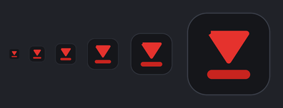

---

## License

**GPLv3** – the author's name (Joachim Ruf, Loresoft.de) must be credited upon publication and
modification.

---

## Support

- Report issues on [GitHub](https://github.com/joruf/youtube-clipster/issues)
- Please attach the output of `python3 run.py --verbose`
