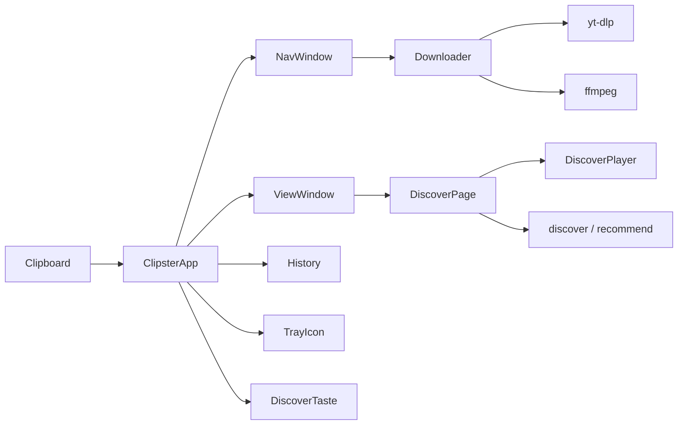

# Technical documentation

Architecture notes for **Loresoft YouTube Clipster** (`clipster/` package). Accurate to the current Python codebase (v2).

## Overview

Clipster is a cross-platform desktop app that:

1. Watches the clipboard for YouTube URLs.
2. Downloads audio/video via **yt-dlp** (+ **ffmpeg** post-processing).
3. Shows progress in a small **navigation window** and a larger **view window** (download list, Streaming, settings, about).
4. Optionally streams related tracks in the **Streaming** tab with an in-app player and stage visualizer.

Entry points: `run.py` → `clipster.cli` (bootstrap / venv / deps) → `ClipsterApp` in `clipster.app`.

## High-level architecture



### Clipboard monitor and download pipeline

`ClipsterApp` (`app.py`) owns the main loop:

- Polls the clipboard every `config.interval_sec` via `clipboard.Clipboard`.
- Recognises YouTube URLs through `downloader.extract_youtube_url`.
- Queues links (up to `MAX_QUEUE`); with `parallel_downloads` several workers may run.
- Fetches metadata, prompts for format / audio language via `bridge.Prompt` + `NavWindow`, then runs `Downloader`.
- Appends outcomes to `history.History` (`history.json`) and refreshes `ViewWindow`.
- Optional side effects: clear clipboard, open folder, open view window, tray tooltip.

Worker threads never touch Tk widgets directly; they call back through `TkBridge`.

### Navigation and view windows

| Window | Module | Role |
|--------|--------|------|
| Hidden Tk root | `gui.Gui` | Owns the process; hosts both windows |
| Nav window | `navwindow.NavWindow` | Format / track choice, progress, result |
| View window | `viewwindow.ViewWindow` | Pages: Streaming, Downloads, Settings, About |

`Gui.build_windows()` constructs both. `show_view(page)` deiconifies the view and may select a page (`discover`, `downloads`, `settings`, `about`). Closing the view usually hides it when the tray is active; Quit ends the process.

### Download pipeline (details)

`downloader.Downloader`:

- Uses yt-dlp for info extraction and download.
- Progress callbacks populate `Progress` for the nav UI.
- Post-process: MP3 extract or MP4 merge via ffmpeg; conversion progress is read from ffmpeg `-progress` output.
- Errors are classified (`bot`, `unavailable`, `metadata`, …) for history and messages.

### Streaming / Discover

| Piece | Module | Notes |
|-------|--------|------|
| Search / related | `discover.py` | Modes: `search`, `related`, `deezer`, `listenbrainz` |
| Free similarity APIs | `recommend.py` | Deezer / ListenBrainz helpers used by discover modes |
| UI | `discover_page.DiscoverPage` | Queue, Now playing, Audio/Video, Stage combobox |
| Player | `player.DiscoverPlayer` | Backends: mpv, ffplay, or audio-only; stream resolve + prefetch |
| Likes / dislikes | `discover_taste.DiscoverTaste` | Persisted taste votes for ranking / filtering |
| Stage drawing | `visualizer.py` + `spectrum.py` | Mode ids + PCM / generative helpers |

Seeds come from successful download history, or from scanning a music folder. Results are `DiscoverTrack` objects (url, video_id, title, uploader, duration, …).

Streamer playback never requires a finished download: the player resolves a direct stream URL with yt-dlp (`resolve_stream_url`) and plays it. Prefetch warms the next items in a background thread.

### Player and visualizer

`config.discover_visualizer` stores the stage mode. Combobox order (`VISUALIZER_MODES`):

`off` → `text` → `waveform` → `cover` → `pulse` → `spectrum` → `visualizer`

**Default for new installs: `pulse`** (Beat ring). Unknown / legacy values are normalised by `normalize_visualizer()` (e.g. `beat` → `pulse`, `rms`/`loudness` → `waveform`).

PCM-backed modes (`spectrum`, `waveform`, `pulse`) read analysis from `DiscoverPlayer` when available; otherwise the page falls back to generative motion (`FakeSpectrum`, generative waveform / pulse energy).

`config.discover_play_video` selects Video vs Audio in the Streaming UI.

### Config and terms

- `config.Config` — JSON under the app data dir (or portable `config.json` next to `run.py`).
- `terms.py` — versioned acceptance: `TERMS_APP_VERSION`, `TERMS_STREAMING_VERSION`.
- App terms gate startup (`ClipsterApp._ensure_app_terms`); Streaming terms gate Discover actions.
- UI: `Gui.ask_terms_acceptance` (checkbox + Accept/Decline) and `Gui.show_terms_document` (About / read-only).

### Tray

`tray.TrayIcon` (pystray) when `use_tray` is true and the backend works. Click opens the view window; menu offers Show / Open folder / Quit. Without a tray, the view window stays visible and closing it quits.

### Install on Android

`android.py` wraps `adb`; `parse_devices` is a pure function so every device state is testable without
a phone, and the tests use a fake `adb` on PATH. The bundle deliberately omits `config.json` and
`history.json` - the configuration holds this machine's remote token.

The flow ends with one line the user runs inside Termux, and that is not a shortcut: `adb shell` runs as
the `shell` user while Termux's home lives in its own private app storage, so the PC cannot write there.
The archive goes to `/sdcard/Download` and Termux picks it up.

`android_dialog.py` runs every adb call on a worker thread and those threads never touch Tk - they queue
their result and the Tk thread drains it on a timer. `widget.after()` from another thread appears to
work and then raises "main thread is not in main loop".

### Headless

`--headless` swaps two objects instead of touching the hundred places in `app.py` that reach for the
interface: `HeadlessRoot` provides the `after` / `after_cancel` / `mainloop` that Tk's root would - one
thread runs every callback, as inside Tk's loop, so code relying on that stays correct - and
`HeadlessGui` answers every interface call and does nothing visible. `view` is `None`, which the
application already handles everywhere.

Mind the thread rule: `TkBridge` only drains on the thread that called `start()`, and `run()` starts it
and then enters `mainloop()` on that same thread. Running the loop elsewhere makes every marshalled
call hang.

Streaming is unavailable in this mode - the queue and player belong to `DiscoverPage` - and reports
itself as `unavailable` rather than failing. The format question cannot be asked either, so headless
downloads always carry their format, which is what a remote request does anyway.

### Phone interface

Off by default (`remote_enabled`), and bound to loopback until `remote_bind` is changed. A
`ThreadingHTTPServer` on a daemon thread, started from `ClipsterApp.run`. Requests arrive on their own
threads: `submit_remote` / `delete_remote` marshal themselves onto the Tk thread through `TkBridge`,
while `remote_status` and the history are read directly, because the phone polls. `HistoryEntry.identifier`
gives the phone a handle that survives a restart without adding a field to `history.json`.
`webserver.phone_url` builds the address the phone needs and is shared with
`tools/phone_link.py`, so the program and the QR code can never disagree. See
[README - Remote control](../README.md#remote-control-phone-tablet-another-pc).

Streaming is operated remotely through `discover_remote_state` / `discover_remote_command`, which marshal
onto the Tk thread and drive the existing `DiscoverPage` - the PC keeps playing, the phone only steers.
The Streaming terms are *checked*, never asked for: the question is a modal dialog on the PC, so asking
would block the phone's request until somebody walks over. Mind the player's mixed API: `tracks`, `index`,
`playing` and `current` are properties, `position()`, `duration()`, `can_seek()` and `energy_level()` are
methods.

A track picked from a search is inserted at `player.index + 1` (or 0 when nothing has played), by
`DiscoverPage.insert_tracks` / `DiscoverPlayer.insert_tracks` - deliberately not `set_playlist`, which
stops the player and would cut off the running song. The device may play a hit before the queue has
caught up: `discover_remote_search` remembers the ids it offered, because a phone only permits playback
while the tap is still live and awaiting the round trip loses that permission.

Both queues keep the playing row centred - `DiscoverPage.centre_on` and `centreQueue` in `app.js` - and
only when the track changes, so scrolling by hand is not fought.

Playing on the device goes through `GET /stream/<video_id>`: the URL is resolved with
`player.BROWSER_AUDIO_FORMAT` (m4a first - Safari plays AAC, not Opus-in-WebM), cached for
`REMOTE_AUDIO_TTL`, and relayed rather than redirected, because YouTube's URLs are bound to the
resolving machine and expire. Only video ids that are actually in the queue resolve, so this is not an
open resolver. The relay passes a `Range` through and, when the source ignores it, answers the `206`
itself - without one Safari plays nothing. Volume goes over mpv's IPC socket (`player._mpv_send`),
which audio-only playback now opens too; `ffplay` cannot be adjusted after start and reports itself as
uncontrollable.

Content types come from the fixed `webserver.CONTENT_TYPES` table, never from
`mimetypes.guess_type`: that builds its table lazily and is not thread safe, and a browser fetching
page, style, script and icon at once puts four server threads into it simultaneously - which can abort
the process and take the downloader with it.

### Bootstrap / installer

`cli.py` + `installer.py` + `dependencies.py`: ensure Python, tkinter, venv, yt-dlp, ffmpeg, clipboard helpers, optional tray stack. `setup_ui.py` shows the setup window while deps install - naming the component in progress, and reporting an unfinished setup in a dialog, because `run.bat` starts `pythonw.exe` and there is no console to print to.

## Module map

| Module | Purpose |
|--------|---------|
| `__init__.py` | App name / version constants |
| `__main__.py` | `python -m clipster` |
| `app.py` | Clipboard monitor, download orchestration, Discover wiring, terms gates |
| `bridge.py` | Marshal calls onto the Tk thread (`Prompt`, callbacks) |
| `cli.py` | CLI flags, bootstrap, relaunch into venv |
| `clipboard.py` | Cross-platform clipboard backends |
| `config.py` | User settings dataclass + load/save |
| `dependencies.py` | Declarative dependency table |
| `discover.py` | DiscoverTrack, seed resolution, search/related/provider modes |
| `discover_page.py` | Streaming page UI |
| `discover_taste.py` | Persistent like/dislike store |
| `downloader.py` | yt-dlp / ffmpeg integration |
| `gui.py` | Tk root, window ownership, terms dialogs, toasts |
| `history.py` | Download history model + `history.json` |
| `i18n.py` | Locale JSON loader |
| `installer.py` | Install missing deps |
| `logging_setup.py` | Console + file logging |
| `navwindow.py` | Small download prompt / progress window |
| `paths.py` | Platform paths; `YOUTUBE_CLIPSTER_HOME` override |
| `player.py` | In-tab Streaming player |
| `recommend.py` | Deezer / ListenBrainz similarity helpers |
| `setup_ui.py` | Early setup window: progress, failure dialog |
| `shortcuts.py` | Desktop shortcut + autostart |
| `singleinstance.py` | Single-instance lock |
| `spectrum.py` | EQ / FakeSpectrum helpers |
| `terms.py` | Terms version helpers |
| `theme.py` | Dark palette + ttk styles |
| `tray.py` | System tray icon |
| `updater.py` | GitHub update check / apply / restart |
| `webserver.py` | Phone interface transport: HTTP, token, Range requests, static table |
| `webapi.py` | Phone interface endpoints as plain data, no HTTP |
| `phone_page.py` | The Remote page (file name unchanged): switch, QR code, live status, firewall hint |
| `phonesetup.py` | The same setup as a console wizard (`--phone-setup`) |
| `qrview.py` | Draws a QR code onto a Tk canvas (no Pillow needed) |
| `scroller.py` | Scrollable container shared by the table and the Phone page |
| `headless.py` | `--headless`: a timer-only event loop plus a do-nothing interface |
| `android.py` | adb wrapper: device states, bundle, push with progress |
| `android_dialog.py` | The four-step "Install on Android" window |
| `web/` | The page the phone loads (HTML, CSS, JS, manifest, service worker) |
| `viewwindow.py` | Large multi-page window |
| `visualizer.py` | Stage mode ids and drawing helpers |
| `locales/*.json` | UI strings (`en`, `de`) |

## Configuration keys overview

Defaults live on `Config` and in `config.example.json`.

### General

| Key | Default | Meaning |
|-----|---------|---------|
| `language` | `en` | UI language (`en` / `de`) |
| `download_dir` | `""` | Empty → OS downloads folder |
| `interval_sec` | `2.0` | Clipboard poll interval |
| `show_startup_notification` | `true` | Startup toast |
| `default_format` | `mp3` | Nav window preselection |
| `open_view_after_download` | `false` | Open view when a download finishes |
| `history_limit` | `100` | Max history rows |
| `check_updates` | `true` | GitHub update check |
| `parallel_downloads` | `false` | Concurrent downloads |
| `max_parallel_downloads` | `3` | Cap when parallel |
| `use_tray` | `true` | System tray icon |
| `start_minimized` | `true` | Start without showing the view |
| `open_folder_after_download` | `false` | Reveal folder on success |
| `file_manager` | `""` | Explicit file manager command |
| `clear_clipboard_after_download` | `true` | Clear clipboard after success |
| `ask_audio_language` | `true` | Ask when multiple audio tracks exist |
| `no_playlist` | `true` | Never download whole playlists |
| `restrict_filenames` | `false` | ASCII filenames |
| `output_template` | `%(title)s.%(ext)s` | yt-dlp output template |
| `user_agent` | `""` | Optional HTTP user agent |
| `cookies_from_browser` | `""` | yt-dlp `cookiesfrombrowser` (`firefox` / `chrome` / …; empty = off) |
| `cookies_file` | `""` | Path to Netscape `cookies.txt` for yt-dlp |
| `ask_desktop_shortcut` | `true` | Ask once about a desktop shortcut |
| `autostart` | `false` | Login autostart |
| `update_check_hours` | `24` | yt-dlp update cadence (`0` = every start) |
| `log_level` | `INFO` | Logging level |

### Streaming / Discover

| Key | Default | Meaning |
|-----|---------|---------|
| `discover_search_suffix` | `lyrics` | Appended to search titles; empty disables |
| `discover_require_suffix` | `true` | Keep only titles containing the suffix |
| `discover_mode` | `related` | `search` / `related` / `deezer` / `listenbrainz` |
| `discover_max_results` | `40` | Cap on listed results |
| `discover_results_per_seed` | `6` | Hits requested per seed |
| `discover_min_folder_seeds` | `5` | Stop collecting seeds once this many exist |
| `discover_disk_scan_enabled` | `true` | Bounded Music/Downloads scan when seeds are sparse |
| `discover_extend_remaining` | `3` | Auto-extend when this many tracks remain |
| `discover_extend_count` | `8` | How many to fetch on extend |
| `discover_play_video` | `false` | Video vs audio playback preference |
| `discover_visualizer` | `pulse` | Stage mode (Beat ring default) |

### Terms

| Key | Meaning |
|-----|---------|
| `terms_app_version` / `terms_app_accepted_at` | Accepted app terms revision + UTC timestamp |
| `terms_streaming_version` / `terms_streaming_accepted_at` | Accepted Streaming terms revision + UTC timestamp |

`path` on `Config` is the file location and is **not** serialised into JSON.

## Data locations

| Item | Linux / macOS | Windows |
|------|---------------|---------|
| Config / log / history | `~/.local/share/YoutubeClipster/` | `%LOCALAPPDATA%\YoutubeClipster\` |
| Venv | same `…/venv` | same |
| Override | env `YOUTUBE_CLIPSTER_HOME` | same |
| Portable config | `config.json` next to `run.py` | same |

Tests set `YOUTUBE_CLIPSTER_HOME` to a temp dir (see `tests/conftest.py`) so the suite never touches real user data.

## Testing how-to

Dev deps: `pip install -r requirements-dev.txt` (venv recommended).

```bash
# Full suite (GUI tests need a display; use xvfb on headless Linux)
.venv/bin/python -m pytest

# Without GUI
.venv/bin/python -m pytest -m "not gui"

# GUI only, headless
xvfb-run -a .venv/bin/python -m pytest -m gui

# Focused modules
.venv/bin/python -m pytest tests/test_config.py tests/test_visualizer.py -v

# Network tests (deselected by default)
.venv/bin/python -m pytest -m network
```

Markers are defined in `pytest.ini`. Contract / cross-platform checks also live under `tests/`.

### Doc screenshots

Anonymized UI captures for the README / user guide:

```bash
xvfb-run -a -s "-screen 0 1400x900x24" .venv/bin/python tools/capture_screenshots.py
```

Writes PNGs under `docs/images/` using the real Tk UI and fixture data (no personal paths, example.com-style ids).

## Related docs

- [User guide](USER_GUIDE.md) — install, Streaming, settings, troubleshooting
- [README](../README.md) — features, install, screenshots
