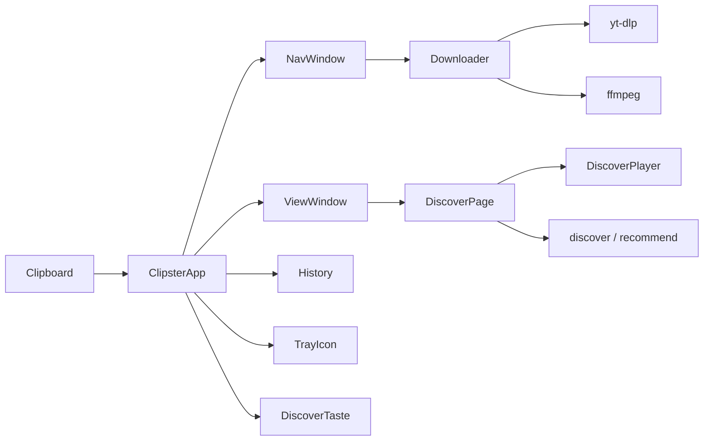

# Technical documentation

Architecture notes for **Loresoft YouTube Clipster** (`clipster/` package). Accurate to the current Python codebase (v2).

## Overview

Clipster is a cross-platform desktop app that:

1. Watches the clipboard for YouTube URLs.
2. Downloads audio/video via **yt-dlp** (+ **ffmpeg** post-processing).
3. Shows progress in a small **navigation window** and a larger **view window** (download list, Streaming, settings, about).
4. Optionally streams related tracks in the **Streaming** tab with an in-app player and stage visualizer.

Entry points: `run.py` → `clipster.cli` (bootstrap / venv / deps) → `ClipsterApp` in `clipster.app`.

## High-level architecture



### Clipboard monitor and download pipeline

`ClipsterApp` (`app.py`) owns the main loop:

- Polls the clipboard every `config.interval_sec` via `clipboard.Clipboard`.
- Recognises YouTube URLs through `downloader.extract_youtube_url`.
- Queues links (up to `MAX_QUEUE`); with `parallel_downloads` several workers may run.
- Fetches metadata, prompts for format / audio language via `bridge.Prompt` + `NavWindow`, then runs `Downloader`.
- Appends outcomes to `history.History` (`history.json`) and refreshes `ViewWindow`.
- Optional side effects: clear clipboard, open folder, open view window, tray tooltip.

Worker threads never touch Tk widgets directly; they call back through `TkBridge`.

### Navigation and view windows

| Window | Module | Role |
|--------|--------|------|
| Hidden Tk root | `gui.Gui` | Owns the process; hosts both windows |
| Nav window | `navwindow.NavWindow` | Format / track / section choice, progress, result |
| View window | `viewwindow.ViewWindow` | Pages: Streaming, Downloads, Settings, About |

The download table keeps its geometry in one place: `ViewWindow._configure_columns()` applies the
same column widths to the heading strip and to every row, so the two can never drift apart.

- **Sorting** — `_COLUMNS` ties a sort key to its grid column, `_SORT_KEYS` says how that column
  compares (`size` by bytes, not by the rendered `9 MB`). `set_sort()` toggles the direction when
  the same column is clicked again; `_visible_entries()` filters and then sorts, stable, so equal
  rows keep their history order. The order therefore survives a re-render.
- **Column widths** — `_col_widths` holds the pixels per fixed column; the name column has
  `weight=1` and absorbs the rest. The grips are *placed*, not gridded: an extra grid cell in the
  header would take it out of step with the rows. A drag calls `set_column_width()`, which nudges
  only the changed column on the header and the mounted rows instead of rebuilding the table.
  `_widen_for_headings()` measures the headings once at build time so no clickable heading is
  clipped, in any language.
- **Long names** — `_fit_line()` cuts a name to the pixel width of its cell; the `<Configure>`
  handler feeds the full name to a `tooltip.Tooltip` whenever the shown text differs, and clears it
  again when the name fits. Nothing that is fully visible gets a tip.

`Gui.build_windows()` constructs both. `show_view(page)` deiconifies the view and may select a page (`discover`, `downloads`, `settings`, `about`). Closing the view usually hides it when the tray is active; Quit ends the process.

### Download pipeline (details)

`downloader.Downloader`:

- Uses yt-dlp for info extraction and download.
- Progress callbacks populate `Progress` for the nav UI.
- Post-process: MP3 extract or MP4 merge via ffmpeg; conversion progress is read from ffmpeg `-progress` output.
- Errors are classified (`bot`, `unavailable`, `metadata`, …) for history and messages.

**Sections.** `download(..., section=ClipRange)` cuts one piece out instead of taking the whole video:

- `clip.parse_range()` turns the two nav window fields into a `ClipRange` (or one of the `clip_error_*` message keys). It clamps an end beyond the video, refuses a start behind it, and returns `None` when the fields describe the whole video anyway.
- yt-dlp gets `download_ranges` (a plain callback, not the `download_range_func` helper) plus `force_keyframes_at_cuts`, so the cut lands on the named second rather than the nearest keyframe.
- `clip.output_template()` puts `[1-23_2-45]` in front of the extension. Without it the clip would take the file name of the full download, and since `overwrites` is off, yt-dlp would skip the download and hand back the full file.
- The section length replaces the video length for the progress bar, the disk space check and the history entry; `HistoryEntry.section` holds `ClipRange.key()`, and `History.find_download()` compares it, so a clip is never offered as "already downloaded" for the whole video.

### Streaming / Discover

| Piece | Module | Notes |
|-------|--------|------|
| Search / related | `discover.py` | Modes: `search`, `related`, `deezer`, `listenbrainz` |
| Free similarity APIs | `recommend.py` | Deezer / ListenBrainz helpers used by discover modes |
| UI | `discover_page.DiscoverPage` | Queue, Now playing, Audio/Video, Stage combobox |
| Player | `player.DiscoverPlayer` | Backends: mpv, ffplay, or audio-only; stream resolve + prefetch |
| Likes / dislikes | `discover_taste.DiscoverTaste` | Persisted taste votes for ranking / filtering |
| Stage drawing | `visualizer.py` + `spectrum.py` | Mode ids + PCM / generative helpers |

Seeds come from successful download history, or from scanning a music folder. Results are `DiscoverTrack` objects (url, video_id, title, uploader, duration, …).

Streamer playback never requires a finished download: the player resolves a direct stream URL with yt-dlp (`resolve_stream_url`) and plays it. Prefetch warms the next items in a background thread.

### Player and visualizer

`config.discover_visualizer` stores the stage mode. Combobox order (`VISUALIZER_MODES`):

`off` → `text` → `waveform` → `cover` → `pulse` → `spectrum` → `visualizer`

**Default for new installs: `pulse`** (Beat ring). Unknown / legacy values are normalised by `normalize_visualizer()` (e.g. `beat` → `pulse`, `rms`/`loudness` → `waveform`).

PCM-backed modes (`spectrum`, `waveform`, `pulse`) read analysis from `DiscoverPlayer` when available; otherwise the page falls back to generative motion (`FakeSpectrum`, generative waveform / pulse energy).

`config.discover_play_video` selects Video vs Audio in the Streaming UI.

### Config and terms

- `config.Config` — JSON under the app data dir (or portable `config.json` next to `run.py`).
- `terms.py` — versioned acceptance: `TERMS_APP_VERSION`, `TERMS_STREAMING_VERSION`.
- App terms gate startup (`ClipsterApp._ensure_app_terms`); Streaming terms gate Discover actions.
- UI: `Gui.ask_terms_acceptance` (checkbox + Accept/Decline) and `Gui.show_terms_document` (About / read-only).

### Tray

`tray.TrayIcon` (pystray) when `use_tray` is true and the backend works. Click opens the view window; menu offers Show / Open folder / Quit. Without a tray, the view window stays visible and closing it quits.

### Install on Android

`android.py` wraps `adb`; `parse_devices` is a pure function so every device state is testable without
a phone, and the tests use a fake `adb` on PATH. The bundle deliberately omits `config.json` and
`history.json` - the configuration holds this machine's remote token.

The flow ends inside Termux. Preferred path (official GitHub/F-Droid Termux, debuggable): push the
archive to `/data/local/tmp`, `run-as com.termux cp` it into Termux's home, then type only
`bash ~/clipster-phone-setup.sh`. That avoids `/sdcard`, which often returns *Permission denied*
until all-files access is granted. Fallback: push to `/sdcard/Download` and type
`bash /sdcard/Download/clipster-phone-setup.sh`. Long `;` / `&&` lines are never sent through
`input text`, because many skins (notably MIUI) drop them. The script unpacks the archive and runs
`install-android.sh --accept-terms` after the wizard showed the terms on the PC.

*Where* that script runs is fixed; who starts it is not. `run_on_phone()` dismisses the notification
shade, launches Termux, waits for it to reach the foreground (plus a short settle pause for MIUI),
and sends the short command with `adb shell input text` followed by keyevent 66. Details that matter:

* `input text` types into **whatever holds the focus**. So `foreground_app()` parses `dumpsys window`
  for `mCurrentFocus` and the run is abandoned unless the package is `com.termux` - otherwise a shell
  command could be typed into a chat window. This is the reason the check exists, not politeness.
* `input text` reads `%s` as a space, so spaces are substituted and the whole string is single-quoted
  for the phone's shell. `typeable()` refuses anything containing `'`, `%` or a newline instead of
  typing it wrongly; a half-typed shell command is worse than none. A test asserts the real launch
  command passes that gate.
* Play Store Termux (`versionName` containing `googleplay`) is detected and offered for replacement
  with the official GitHub APK via `adb install -r`. Storage permission on the phone stays manual.

`android_dialog.py` runs every adb call on a worker thread and those threads never touch Tk - they queue
their result and the Tk thread drains it on a timer. `widget.after()` from another thread appears to
work and then raises "main thread is not in main loop".

#### Installing adb, and why Windows is the odd one out

`adb_install_plan()` is side-effect free so the window can show the exact command before anything runs,
and so every platform's answer is testable. It returns one of three kinds:

* `package` - the distribution's own `adb` / `android-tools`, mapped per package manager in
  `installer.py`. The distribution already redistributes it under Apache 2.0; nothing extra is agreed to.
* `winget` - Windows has no such repository, so `Google.PlatformTools` is fetched. Those carry Google's
  own SDK licence, which is why `install_adb()` takes `accept_licence` and refuses without it. The
  window's question names the licence and links the terms; the Yes is the acceptance. Auto-accepting a
  third party's licence on the user's behalf - or downloading and unpacking the SDK ZIP directly to dodge
  the question - is the version this deliberately does not do.
* `manual` - nothing here can do it, so no button is offered rather than one that cannot work.

After a Windows install `adb` is on the `PATH` of *new* processes, not of this one, so `adb_path()` also
looks inside winget's package directory. The wizard rescans instead of trusting the exit code, and the
failure reason is kept in `_adb_error` because that rescan would otherwise replace it with a generic
"adb is missing" a moment later.

#### Asking before installing

`install_system_packages` consults a confirm function and installs nothing on a no (exit code
`DECLINED`, distinct from any real failure). It is a module-level hook (`set_install_confirm`) rather
than an argument on all fifteen `ensure_*` functions - they all funnel through one place anyway, and the
setup scripts had to keep working untouched. `bootstrap(ask=True)` sets `console_confirm` and drops it
again on every exit path, including the aborted ones; the hook is process wide.

`console_confirm` says yes when there is no terminal. That is the point: `run.bat` and a double-clicked
`run.py` have no tty, and a question nobody can see must not stall the setup. Under `pythonw.exe` the
streams are `None` rather than merely not a tty, which is why `_interactive()` checks for the object
before asking it anything.

Privilege escalation had to grow a second path for the window. `sudo -p` writes its prompt to a tty; with
no tty it simply fails, so `privileged_script(..., graphical=True)` uses an already-valid sudo timestamp
if there is one, then `pkexec` (which brings its own dialog), and returns `None` rather than a command
that would hang. Commands are joined with `;`, not `&&`, so one broken third-party repository breaking
`apt-get update` does not also cancel the install - the exit status is the install's.

### Headless

`--headless` swaps two objects instead of touching the hundred places in `app.py` that reach for the
interface: `HeadlessRoot` provides the `after` / `after_cancel` / `mainloop` that Tk's root would - one
thread runs every callback, as inside Tk's loop, so code relying on that stays correct - and
`HeadlessGui` answers every interface call and does nothing visible. `view` is `None`, which the
application already handles everywhere.

Mind the thread rule: `TkBridge` only drains on the thread that called `start()`, and `run()` starts it
and then enters `mainloop()` on that same thread. Running the loop elsewhere makes every marshalled
call hang.

Streaming is unavailable in this mode - the queue and player belong to `DiscoverPage` - and reports
itself as `unavailable` rather than failing. The format question cannot be asked either, so headless
downloads always carry their format, which is what a remote request does anyway.

### Phone interface

Off by default (`remote_enabled`), and bound to loopback until `remote_bind` is changed. A
`ThreadingHTTPServer` on a daemon thread, started from `ClipsterApp.run`. Requests arrive on their own
threads: `submit_remote` / `delete_remote` marshal themselves onto the Tk thread through `TkBridge`,
while `remote_status` and the history are read directly, because the phone polls. `HistoryEntry.identifier`
gives the phone a handle that survives a restart without adding a field to `history.json`.
`webserver.phone_url` builds the address the phone needs and is shared with
`tools/phone_link.py`, so the program and the QR code can never disagree. See
[README - Remote control](../README.md#remote-control-phone-tablet-another-pc).

Streaming is operated remotely through `discover_remote_state` / `discover_remote_command`, which marshal
onto the Tk thread and drive the existing `DiscoverPage` - the PC keeps playing, the phone only steers.
The Streaming terms are *checked*, never asked for: the question is a modal dialog on the PC, so asking
would block the phone's request until somebody walks over. Mind the player's mixed API: `tracks`, `index`,
`playing` and `current` are properties, `position()`, `duration()`, `can_seek()` and `energy_level()` are
methods.

A track picked from a search is inserted at `player.index + 1` (or 0 when nothing has played), by
`DiscoverPage.insert_tracks` / `DiscoverPlayer.insert_tracks` - deliberately not `set_playlist`, which
stops the player and would cut off the running song. The device may play a hit before the queue has
caught up: `discover_remote_search` remembers the ids it offered, because a phone only permits playback
while the tap is still live and awaiting the round trip loses that permission.

Both queues keep the playing row centred - `DiscoverPage.centre_on` and `centreQueue` in `app.js` - and
only when the track changes, so scrolling by hand is not fought.

Playing on the device goes through `GET /stream/<video_id>`: the URL is resolved with
`player.BROWSER_AUDIO_FORMAT` (m4a first - Safari plays AAC, not Opus-in-WebM), cached for
`REMOTE_AUDIO_TTL`, and relayed rather than redirected, because YouTube's URLs are bound to the
resolving machine and expire. Only video ids that are actually in the queue resolve, so this is not an
open resolver. The relay passes a `Range` through and, when the source ignores it, answers the `206`
itself - without one Safari plays nothing. Volume goes over mpv's IPC socket (`player._mpv_send`),
which audio-only playback now opens too; `ffplay` cannot be adjusted after start and reports itself as
uncontrollable.

Content types come from the fixed `webserver.CONTENT_TYPES` table, never from
`mimetypes.guess_type`: that builds its table lazily and is not thread safe, and a browser fetching
page, style, script and icon at once puts four server threads into it simultaneously - which can abort
the process and take the downloader with it.

Three more media routes exist next to `/stream/`:

* `GET /queue/<index>` serves a queue row that plays from disk - the library. On Android the backend
  *is* on the phone, so this is how downloaded songs play with the radio switched off. The path never
  travels; only the index does, and `ClipsterApp.queue_track_path` resolves it.
* `GET /video/<video_id>` is the same relay with `player.BROWSER_VIDEO_FORMAT`: one progressive MP4,
  because a `<video>` element cannot mux separate streams the way mpv does.
* `GET /api/qr?v=<video_id>` returns the share code as SVG, built by `qrview.qr_svg`. Only a video id
  is accepted and the URL is built server-side - a share button, not a text-to-QR service.

`POST /api/scan` takes what a camera read and parses it with `downloader.extract_video_id`, the same
function the clipboard watcher uses, then queues it without starting it. The decoder runs in the
browser (`web/vendor/jsqr.js`, checked in) because decoding in Python would mean `pyzbar` or OpenCV -
native libraries, on Termux, on a phone. `getUserMedia` needs a secure context, which the Android
launcher has because it loads `http://127.0.0.1`; over a LAN address the Scan button hides itself.

### Feature parity with Android

Android is not a second program - it is this page, wrapped in a WebView by
`tools/android/launcher/`. So a desktop feature is only finished when `clipster/web/` has it too, and
`tests/test_platform_parity.py` fails when it does not: every Streaming control and every remotely
editable setting has a row there.

Two rules keep the platforms from drifting rather than merely re-synchronising them:

* **One play order.** `playorder.PlayOrder` decides what comes after a song. `DiscoverPage` and
  `HeadlessDiscoverSession` both hold one, and the phone asks over `POST /api/discover/next` instead
  of taking the next row down the list - which is exactly how shuffle and repeat used to be
  desktop-only.
* **One connection rule.** `netmode` decides between streaming and the download folder. Only the
  device on the connection can know what it is, so `app.js` reports it with its status polls
  (`/api/status?net=cellular`); a desktop reports nothing and is therefore never restricted. The rule
  is applied twice on purpose - in the queue and again in `discover_remote_audio` - so a page left
  open on a phone cannot keep pulling audio after the user walks out of Wi-Fi.

### Bootstrap / installer

`cli.py` + `installer.py` + `dependencies.py`: ensure Python, tkinter, venv, yt-dlp, ffmpeg, clipboard helpers, optional tray stack. `setup_ui.py` shows the setup window while deps install - naming the component in progress, and reporting an unfinished setup in a dialog, because `run.bat` starts `pythonw.exe` and there is no console to print to.

## Module map

| Module | Purpose |
|--------|---------|
| `__init__.py` | App name / version constants |
| `__main__.py` | `python -m clipster` |
| `app.py` | Clipboard monitor, download orchestration, Discover wiring, terms gates |
| `bridge.py` | Marshal calls onto the Tk thread (`Prompt`, callbacks) |
| `cli.py` | CLI flags, bootstrap, relaunch into venv |
| `clip.py` | Section downloads: time parsing, validation, file name marker |
| `clipboard.py` | Cross-platform clipboard backends |
| `config.py` | User settings dataclass + load/save |
| `dependencies.py` | Declarative dependency table |
| `discover.py` | DiscoverTrack, seed resolution, search/related/provider modes |
| `discover_page.py` | Streaming page UI |
| `discover_taste.py` | Persistent like/dislike store |
| `downloader.py` | yt-dlp / ffmpeg integration |
| `gui.py` | Tk root, window ownership, terms dialogs, toasts |
| `history.py` | Download history model + `history.json` |
| `i18n.py` | Locale JSON loader |
| `installer.py` | Install missing deps |
| `logging_setup.py` | Console + file logging |
| `navwindow.py` | Small download prompt / progress window |
| `netmode.py` | The one rule deciding streaming vs. downloaded files on a connection |
| `paths.py` | Platform paths; `YOUTUBE_CLIPSTER_HOME` override |
| `player.py` | In-tab Streaming player |
| `playorder.py` | Shuffle, repeat and the shuffle bag, shared by the page and the phone |
| `recommend.py` | Deezer / ListenBrainz similarity helpers |
| `setup_ui.py` | Early setup window: progress, failure dialog |
| `shortcuts.py` | Desktop shortcut + autostart |
| `singleinstance.py` | Single-instance lock |
| `spectrum.py` | EQ / FakeSpectrum helpers |
| `terms.py` | Terms version helpers |
| `theme.py` | Dark palette + ttk styles |
| `tray.py` | System tray icon |
| `updater.py` | GitHub update check / apply / restart |
| `webserver.py` | Phone interface transport: HTTP, token, Range requests, static table |
| `webapi.py` | Phone interface endpoints as plain data, no HTTP |
| `phone_page.py` | The Remote page (file name unchanged): switch, QR code, live status, firewall hint |
| `phonesetup.py` | The same setup as a console wizard (`--phone-setup`) |
| `qrview.py` | Draws a QR code onto a Tk canvas or as SVG (no Pillow needed) |
| `scroller.py` | Scrollable container shared by the table and the Phone page |
| `tooltip.py` | The hover popup shared by the Streaming page and the download list |
| `headless.py` | `--headless`: a timer-only event loop plus a do-nothing interface |
| `android.py` | adb wrapper: device states, bundle, push with progress |
| `android_dialog.py` | The four-step "Install on Android" window |
| `web/` | The page the phone loads (HTML, CSS, JS, manifest, service worker) |
| `web/vendor/` | Third-party code served to the phone, checked in with its licence |
| `viewwindow.py` | Large multi-page window |
| `visualizer.py` | Stage mode ids and drawing helpers |
| `locales/*.json` | UI strings (`en`, `de`) |

## Configuration keys overview

Defaults live on `Config` and in `config.example.json`.

### General

| Key | Default | Meaning |
|-----|---------|---------|
| `language` | `en` | UI language (`en` / `de`) |
| `download_dir` | `""` | Empty → OS downloads folder |
| `interval_sec` | `2.0` | Clipboard poll interval |
| `show_startup_notification` | `true` | Startup toast |
| `default_format` | `mp3` | Nav window preselection |
| `open_view_after_download` | `false` | Open view when a download finishes |
| `history_limit` | `100` | Max history rows |
| `check_updates` | `true` | GitHub update check |
| `parallel_downloads` | `false` | Concurrent downloads |
| `max_parallel_downloads` | `3` | Cap when parallel |
| `use_tray` | `true` | System tray icon |
| `start_minimized` | `true` | Start without showing the view |
| `open_folder_after_download` | `false` | Reveal folder on success |
| `file_manager` | `""` | Explicit file manager command |
| `clear_clipboard_after_download` | `true` | Clear clipboard after success |
| `ask_audio_language` | `true` | Ask when multiple audio tracks exist |
| `no_playlist` | `true` | Never download whole playlists |
| `restrict_filenames` | `false` | ASCII filenames |
| `output_template` | `%(title)s.%(ext)s` | yt-dlp output template |
| `user_agent` | `""` | Optional HTTP user agent |
| `cookies_from_browser` | `""` | yt-dlp `cookiesfrombrowser` (`firefox` / `chrome` / …; empty = off) |
| `cookies_file` | `""` | Path to Netscape `cookies.txt` for yt-dlp |
| `ask_desktop_shortcut` | `true` | Ask once about a desktop shortcut |
| `autostart` | `false` | Login autostart |
| `update_check_hours` | `24` | yt-dlp update cadence (`0` = every start) |
| `log_level` | `INFO` | Logging level |

### Streaming / Discover

| Key | Default | Meaning |
|-----|---------|---------|
| `discover_search_suffix` | `lyrics` | Appended to search titles; empty disables |
| `discover_require_suffix` | `true` | Keep only titles containing the suffix |
| `discover_mode` | `related` | `search` / `related` / `deezer` / `listenbrainz` |
| `discover_max_results` | `40` | Cap on listed results |
| `discover_results_per_seed` | `6` | Hits requested per seed |
| `discover_min_folder_seeds` | `5` | Stop collecting seeds once this many exist |
| `discover_disk_scan_enabled` | `true` | Bounded Music/Downloads scan when seeds are sparse |
| `discover_extend_remaining` | `3` | Auto-extend when this many tracks remain |
| `discover_extend_count` | `8` | How many to fetch on extend |
| `discover_play_video` | `false` | Video vs audio playback preference |
| `discover_visualizer` | `pulse` | Stage mode (Beat ring default) |
| `discover_shuffle` | `false` | Play the queue in random order |
| `discover_repeat` | `off` | `off` / `all` / `one` |
| `playback_on_mobile` | `stream` | On a mobile connection: `stream` / `local` / `ask` |
| `playback_local_only` | `false` | Manual override: downloaded songs only, any connection |

### Terms

| Key | Meaning |
|-----|---------|
| `terms_app_version` / `terms_app_accepted_at` | Accepted app terms revision + UTC timestamp |
| `terms_streaming_version` / `terms_streaming_accepted_at` | Accepted Streaming terms revision + UTC timestamp |

`path` on `Config` is the file location and is **not** serialised into JSON.

## Data locations

| Item | Linux / macOS | Windows |
|------|---------------|---------|
| Config / log / history | `~/.local/share/YoutubeClipster/` | `%LOCALAPPDATA%\YoutubeClipster\` |
| Venv | same `…/venv` | same |
| Override | env `YOUTUBE_CLIPSTER_HOME` | same |
| Portable config | `config.json` next to `run.py` | same |

Tests set `YOUTUBE_CLIPSTER_HOME` to a temp dir (see `tests/conftest.py`) so the suite never touches real user data.

## Testing how-to

Dev deps: `pip install -r requirements-dev.txt` (venv recommended).

```bash
# Full suite (GUI tests need a display; use xvfb on headless Linux)
.venv/bin/python -m pytest

# Without GUI
.venv/bin/python -m pytest -m "not gui"

# GUI only, headless
xvfb-run -a .venv/bin/python -m pytest -m gui

# Focused modules
.venv/bin/python -m pytest tests/test_config.py tests/test_visualizer.py -v

# Network tests (deselected by default)
.venv/bin/python -m pytest -m network
```

Markers are defined in `pytest.ini`. Contract / cross-platform checks also live under `tests/`.

### Doc screenshots

Anonymized UI captures for the README / user guide:

```bash
xvfb-run -a -s "-screen 0 1400x900x24" .venv/bin/python tools/capture_screenshots.py
```

Writes PNGs under `docs/images/` using the real Tk UI and fixture data (no personal paths, example.com-style ids).

## Related docs

- [User guide](USER_GUIDE.md) — install, Streaming, settings, troubleshooting
- [README](../README.md) — features, install, screenshots
