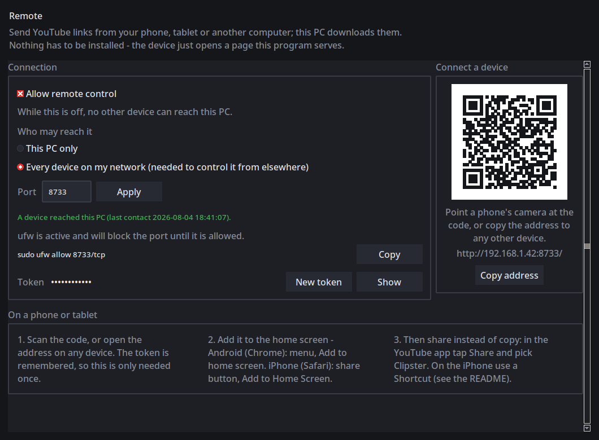
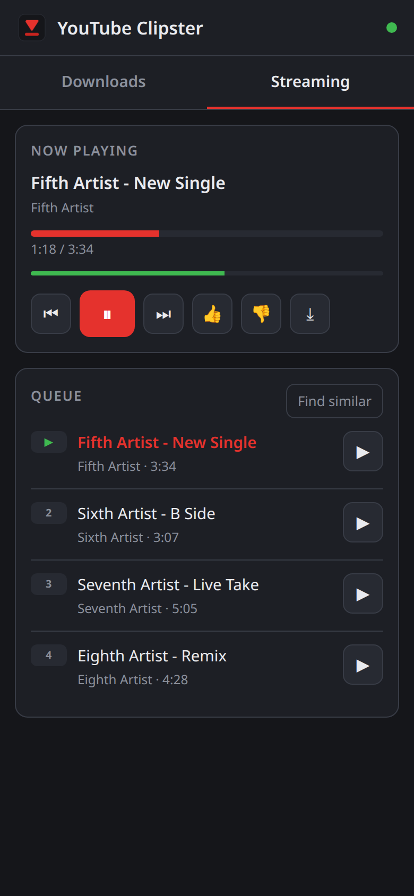
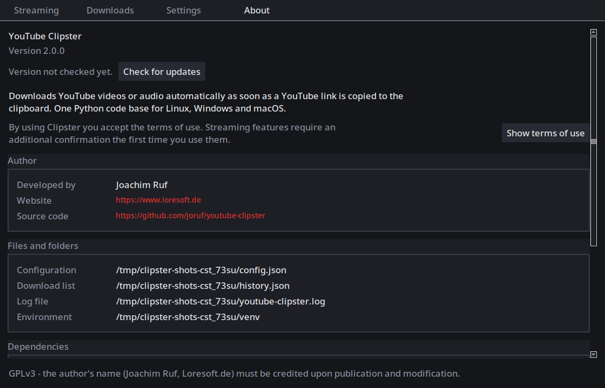

# User guide

End-user guide for **Loresoft YouTube Clipster** — clipboard downloads and Streaming discovery on Linux, Windows, and macOS.

Screenshots below use anonymized sample data.

## What Clipster does

- Watches your clipboard for YouTube links and downloads them as MP3 or MP4.
- Keeps a download history with open / folder / remove actions.
- Offers a **Streaming** tab to find similar songs from your downloads, likes, and local media, and play them in-app with an optional stage visualizer.
- Runs from the system tray (when available) so it stays out of the way.

## Install

### Linux

```bash
git clone https://github.com/joruf/youtube-clipster.git
cd youtube-clipster
chmod +x install.sh run.py
./install.sh
```

The installer installs missing system packages (may ask for `sudo`) and creates a private virtual environment. You can also run `python3 run.py`.

### Windows

```bat
git clone https://github.com/joruf/youtube-clipster.git
cd youtube-clipster
run.bat
```

Or double-click `run.bat`. It starts without a console window and shows a small setup window naming
whatever is being installed at that moment; when everything is in place the program starts by itself.
The first start takes a few minutes because `yt-dlp` and `ffmpeg` are downloaded. Use `install.bat` if
you would rather watch the whole log in a console window.

Allow Defender/SmartScreen prompts for yt-dlp and ffmpeg on first run.

### Requirements (handled automatically)

Python 3.8+, tkinter, yt-dlp, ffmpeg, and a clipboard helper on Linux (`xclip` or `wl-clipboard`). Optional: tray packages (`pystray`, Pillow, …).

## On your phone

You can send links from an Android phone or an iPhone; the PC downloads them. Nothing to install - the
running program serves a small web page.

Open the view window and pick **Remote**. Switch on *Serve the phone interface*, choose *Every device on
my network*, and scan the QR code with the phone. The page says when a phone last reached the PC, so
you can see it working; it also shows the firewall command if one is needed.



The phone has two tabs: **Downloads** for links and the download list, and **Streaming** as a remote
control for the Streaming page - queue, transport, likes and *Find similar*. The sound stays on the PC;
the phone steers. Streaming needs its terms accepted once on the PC before the phone may use it.



Without a window there is `python3 run.py --phone-setup`, which walks through the same steps in the
terminal. The full walkthrough, including the Android share sheet and the iPhone shortcut, is in
[README - Remote control](../README.md#remote-control-phone-tablet-another-pc).


## First start (terms)

On first launch Clipster asks you to accept the **general terms of use**. You must tick the checkbox and choose Accept; Decline quits the program.


When you first use **Streaming** (Find similar / playback), a separate Streaming terms dialog may appear. Acceptance is stored locally in your config (`terms_*` keys) with a version and timestamp.

The About page can open the terms again in read-only form.



## Clipboard downloads

1. Leave Clipster running (tray or view window).
2. Copy a YouTube link (`youtube.com/watch`, `youtu.be`, Shorts, …).
3. The small navigation window opens: confirm **MP3** or **MP4**, and pick an audio language if asked.
4. Watch progress; use Cancel if needed.
5. When finished, open the file or its folder from the nav window.

You can also paste a URL into the **Downloads** page and press Download.


Tips:

- Several links queue up (they are not dropped while a download runs).
- The same URL + format is not downloaded again if the file still exists — you can open it or force a re-download.
- Files go to your Downloads folder unless you change **Download folder** in Settings.

## Streaming tab

Open the view window (tray click, or start with `--show-window`) and select **Streaming**.


### Find similar songs

- **Find similar songs** — builds a queue from download history, liked tracks, and (if needed) media in Downloads / Music.
- **Search mode** — Related videos, YouTube search by title, Deezer similar artists, or ListenBrainz (free providers); sits next to Find similar songs.
- On startup (when Streaming terms are already accepted and the network is up), Clipster can start Find similar automatically in the background without opening the window.
- Title / search ending and the “only titles with that ending” filter live under **Settings** (Streaming section); Streaming uses those values when searching.

### Audio / Video

In **Now playing**:

- **Audio** — in-app audio playback with the stage visualizer (default).
- **Video** — embedded video when a suitable player backend (e.g. mpv) is available; otherwise Clipster may fall back to audio.

### Stage modes

The **Stage** combobox controls the visualizer while audio is playing. Order in the list:

| Label | Mode id | Notes |
|-------|---------|--------|
| Off | `off` | Blank stage |
| Text only | `text` | Minimal placeholder |
| Waveform | `waveform` | Oscilloscope-style line |
| Cover | `cover` | Thumbnail / title |
| Beat ring | `pulse` | Expanding ring driven by energy — **default for new installs** |
| Spectrum | `spectrum` | Frequency bars |
| Visualizer | `visualizer` | Generative mountain silhouette |

New installations default to **Beat ring** (`pulse`). Changing the Stage selection is saved to `discover_visualizer` in your config.

### Queue, likes, and downloads

- Click a queue row to play it; use transport controls for previous / next / pause.
- Per-row download sends that track through the normal download pipeline.
- Like / dislike (taste) votes are stored locally and help shape future recommendations.

Streaming requires accepting the Streaming terms once (see [First start](#first-start-terms)).

## Settings


Useful options:

- Language (English / German)
- Default format (MP3 / MP4)
- Download folder and clipboard interval
- Tray / start minimized
- Parallel downloads
- Streaming search ending, mode, and result limits
- **YouTube cookies** — if downloads or Streaming fail with “Sign in to confirm you’re not a bot”, set **Cookies from browser** (Firefox, Chrome, Chromium, Brave, or Edge while logged into YouTube) or point to a `cookies.txt` export. Clipster never logs cookie contents.
- Update checks

Changes save to `config.json` (see paths below). A full key list is in the [README](../README.md#configuration) and [technical docs](TECHNICAL.md#configuration-keys-overview).

## Updates

If update checks are enabled, Clipster compares your install to the `main` branch on GitHub. From **About** you can check and apply updates when available.

- Git clone: fast-forward `git pull` when the tree is clean.
- Archive install: download ZIP overlay without touching your config or history.

yt-dlp itself is updated on its own schedule (`update_check_hours`), or force with `python3 run.py --update`.

## Configuration paths

| Platform | Directory |
|----------|-----------|
| Linux / macOS | `~/.local/share/YoutubeClipster/` |
| Windows | `%LOCALAPPDATA%\YoutubeClipster\` |

Contains `config.json`, `history.json`, the log file, and the private venv. For a portable checkout, copy `config.example.json` to `config.json` next to `run.py`.

## Troubleshooting basics

**Clipboard not detected (Linux)**  
Install `xclip` (X11) or `wl-clipboard` (Wayland). Run with `--verbose` and look for `Clipboard backend: …`.

**No tkinter**  
Linux: install `python3-tk` (or distro equivalent). Windows: repair Python with tcl/tk enabled.

**Tray missing or no menu**  
The app still works — the view window stays available. Install tray deps / AppIndicator support, or use `--no-tray`. See the README troubleshooting section for package names.

**Already running**  
Only one instance is allowed. Quit from the tray or view window, or end the process.

**Downloads fail (“not a bot” / unavailable)**  
In **Settings**, set YouTube cookies from your browser or a cookies file, wait a bit, or update yt-dlp (`--update`). Check the failed row’s problem text on the Downloads page.

**Streaming won’t play**  
Accept Streaming terms; ensure network access; for video mode install mpv if prompted. Audio mode uses the built-in stage even without mpv. Bot blocks: same cookies settings as downloads.

**Broken environment**  
`python3 run.py --reinstall` rebuilds the venv.

Logs: `youtube-clipster.log` next to your config. Start with `python3 run.py --verbose` when reporting issues.

## More documentation

- [Technical documentation](TECHNICAL.md) — architecture, module map, config keys, testing
- [README](../README.md) — features, installer details, CLI flags
